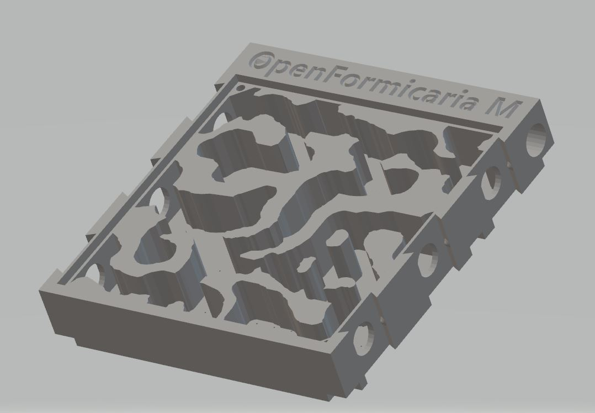

# OpenFormicaria - Formicaria

## General Features
* Modular - any type of insert can be made for specific ant requirements and preferences
* Water Basin Stack for hydration and humidity regulation
* Heat Cable insert
* Cover to give the ants a dark environment
* Plexiglass can be press fitted or via screws
* All Formicaria are available in CV1(Legacy) and CV2 trim

Don't forget to print the basin and lid for your nest!

## Formicaria Size S
Small size formicarium, 70mm x 80mm x 20mm.

### Template Size S

Do it yourself with Photoshop and Microsoft 3D Builder!

### Lasius S

Lasius nest inspired insert

### Plexiglass sizing
The glass cutout is 62mm x 62mm. If you want, you can use a small drill bit that fits M3 screws.

## Formicaria Size M

Medium size formicarium, 105mm x 115mm x 20mm.

### Template Size M

Do it yourself with Photoshop and Microsoft 3D Builder!

### Lasius M

Lasius nest inspired insert

### Plexiglass sizing
The glass cutout is 97mm x 97mm. If you want, you can use a small drill bit that fits M3 screws.

## Other sizes
* Coming soon!