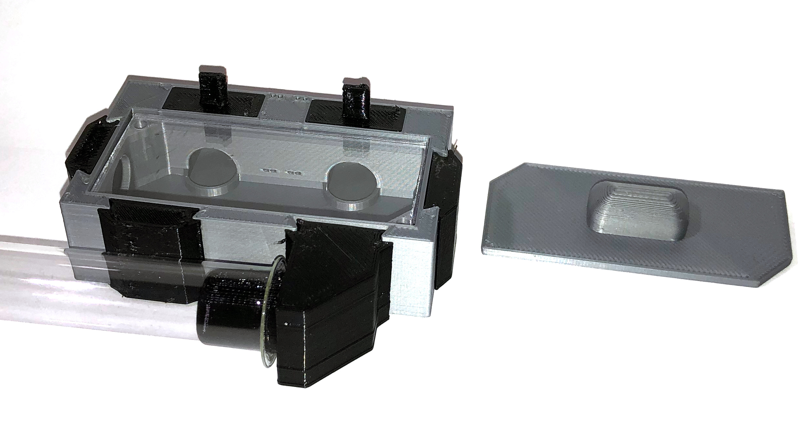
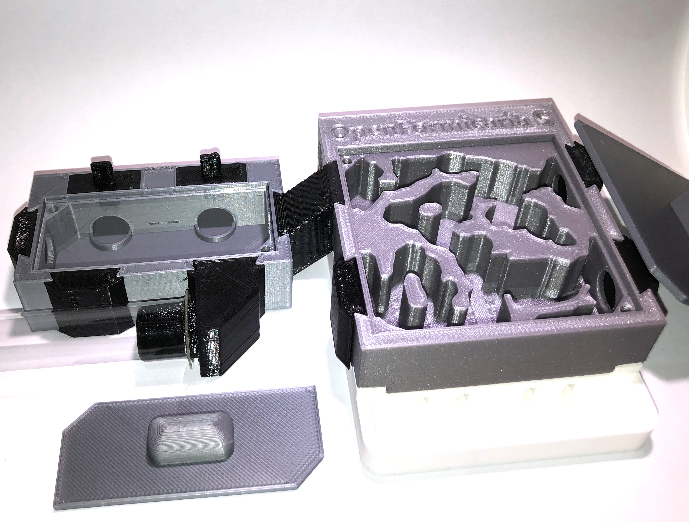

# Getting Started

## Download
You can download all the parts on [Thingiverse](https://www.thingiverse.com/thing:4637707) or directly on the repository on [Github](https://github.com/schemen/OpenFormicaria) for the latest files. You can find the files in the corresponding `STL` folders

## Required Materials
You will need any hard filament (PLA, PETG) for CV1. If you want to use CV2 (which is recommended) you will need a flexible filament like TPU or Flex.

## Connector Version 2 (CV2) and Connector Version 1 (CV1)

There are two version available, both are similar in design with version 2 being improved. The only reason not to use CV2 is if you do not have any flexible filament, CV1 will work for you in that case.

With CV2 you can seemlessly switch connectors that are in use, for example allowing you to block passages between modules by switching out a Connector with a Blocker.

Note that all CV2 connectors **have** to be printed in TPU or any flexible material.

## Part list
You can check out the parts available:

* [Connectors](connectors.md)
* [Modules](modules.md)
* [Formicaria](formicaria.md)

## Set suggestions and Ideas

### The Base Kit - A initial home

If you have a test tube setup and you think your ants are ready for their first scavenging outside of it, while still to small for a proper outworld, you can use a Portal! This allows you to connect several other modules and connectors to it.

Here is a list of the items you should print for a base kit with a Portal. Once you have that, you can expand as needed!
Note that I do recommend printing all CV2 if you have a flexible filament available.

#### The Base Kit
* 1x Portal
  * 2x Portal Feeder Lids
  * 1x Portal Lid
* 2x Separators (CV2 Only)
* 3x Endpoint Blocker
* 2x Tube connector fitting your test tube size
  * The second tube connector can be used to add water or lead to a proper outworld

### A first Formicarium - Expanding your colony

Once the colony has outgrown the test tube setup and needs a proper nest you can start with a S sized nest that fits your colony! 
You can connect your Formicarium directly to the portal or use tubing to connect to it.

Generally, I recommend printing the base kit anyway and expand from there.

#### Your first Formicarium
* 1x S Sized formicarium for your ants
* 3x Endpoint Blocker (4x if you want to connect via tubes)
* 1x Connector Raiser(direct connect)
* 1x Tube connector (tube connection)