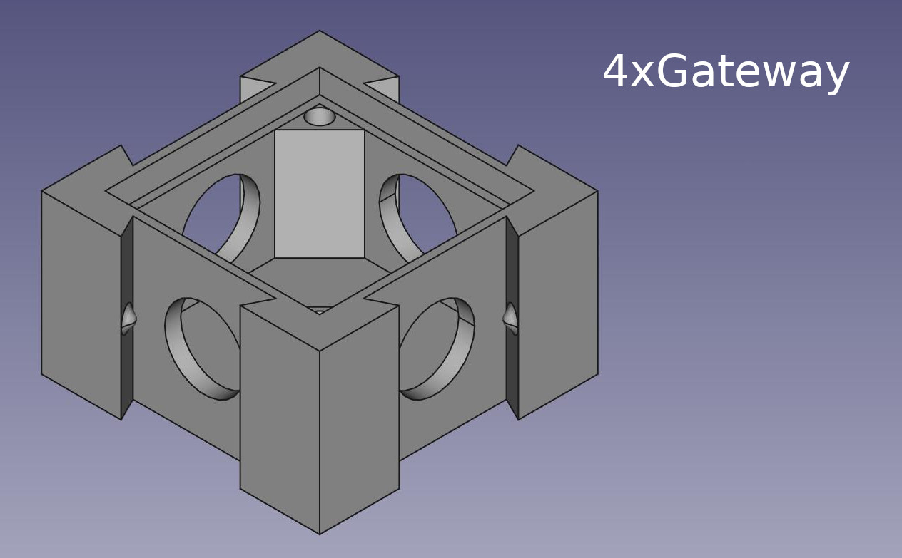

# OpenFormicaria - Modules

## Available modules
A list of Modules that are available!
Note all modules are available in CV1(Legacy) and CV2 trim.

## Print recommendations
All modules can be printed with:

* 0.2mm layer height
* 15% infill
* PLA or any other hard material

Use a color that is relatively contrastring to your ants so you can see them.

## Portal

A module used for founding colonies. Connect your test tube with the queen and brood and the initial few workers here.
This module serves as the first small outworld!

Don't forget to print the cover and feeder lids.

### Features
* Size of 70mm x 40mm x 20mm
* Attach up to 4 other attachments
* Two feeding holes
* Air vents
* Lid to cover the ants if needed
* Either press fit or screw in plexiglass

### Plexiglass sizing
The glass cutout is 26mm x 62mm. If you want, you can use a small drill bit that fits M3 screws.

## 4xGateway

### Features
* Size of 35mm x 35mm x 20mm
* Attach up to 4 other attachements
* Plexiglass for your viewing pleasure

### Plexiglass sizing
The glass cutout is 27mm x 27mm. If you want, you can use a small drill bit that fits M3 screws.

## 6xGateway

### Features
* Size of 70mm x 35mm x 20mm
* Attach up to 6 other attachements or things that can have two or more at the same time!
* More space
* Air Vents
* Plexiglass for your viewing pleasure

### Plexiglass sizing
The glass cutout is 62mm x 27mm. If you want, you can use a small drill bit that fits M3 screws.